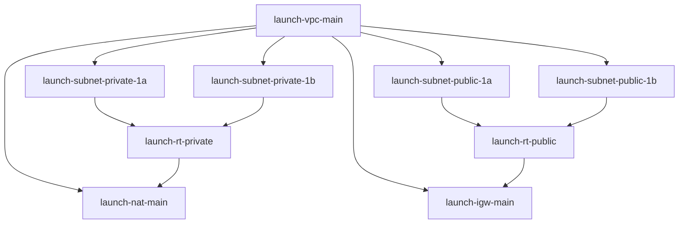

# Resource Tracking

## Resource Inventory
```yaml
VPC Resources:
  Naming: launch-vpc-*
  Limits:
    - VPCs per Region: 5
    - Subnets per VPC: 200
    - Route Tables per VPC: 200
    - Security Groups per VPC: 500
  
  Cost Factors:
    - NAT Gateway Hours
    - Data Transfer
    - VPN Connections

Security Resources:
  Naming: launch-sg-*
  Limits:
    - Rules per Security Group: 60
    - Security Groups per Network Interface: 5
  
  Cost Factors:
    - None (included with instances)

IAM Resources:
  Naming: launch-role-*
  Limits:
    - Roles per Account: 1000
    - Policies per Role: 10
    - Policy Size: 6144 characters
  
  Cost Factors:
    - None (included with account)
```

## Resource Relationships


## Resource State Tracking
```yaml
State Categories:
  ✓ - Verified and Active
  ⚠ - Needs Attention
  ✗ - Failed/Inactive
  ⌛ - Pending Creation

Current State:
  VPC Components:
    launch-vpc-main: ⌛
    launch-subnet-private-1a: ⌛
    launch-subnet-private-1b: ⌛
    launch-subnet-public-1a: ⌛
    launch-subnet-public-1b: ⌛
    
  Network Components:
    launch-igw-main: ⌛
    launch-nat-main: ⌛
    launch-rt-private: ⌛
    launch-rt-public: ⌛
    
  Security Components:
    launch-sg-database: ⌛
    launch-sg-management: ⌛
```

## Cost Tracking
```yaml
Budget Alerts:
  - Threshold: $50/month
    Notification: email
  - Threshold: $100/month
    Notification: email, slack

Resource Cost Estimates:
  NAT Gateway:
    - $0.045 per hour
    - $0.045 per GB data processed
  
  Data Transfer:
    - $0.09 per GB out to internet
    - Free within same AZ
```

## Maintenance Windows
```yaml
Regular Maintenance:
  Window: Sundays 02:00-04:00 UTC
  Frequency: Monthly
  Notice Required: 1 week

Emergency Maintenance:
  Minimum Notice: 1 hour
  Approval Required: Yes
  Rollback Plan: Required
``` 